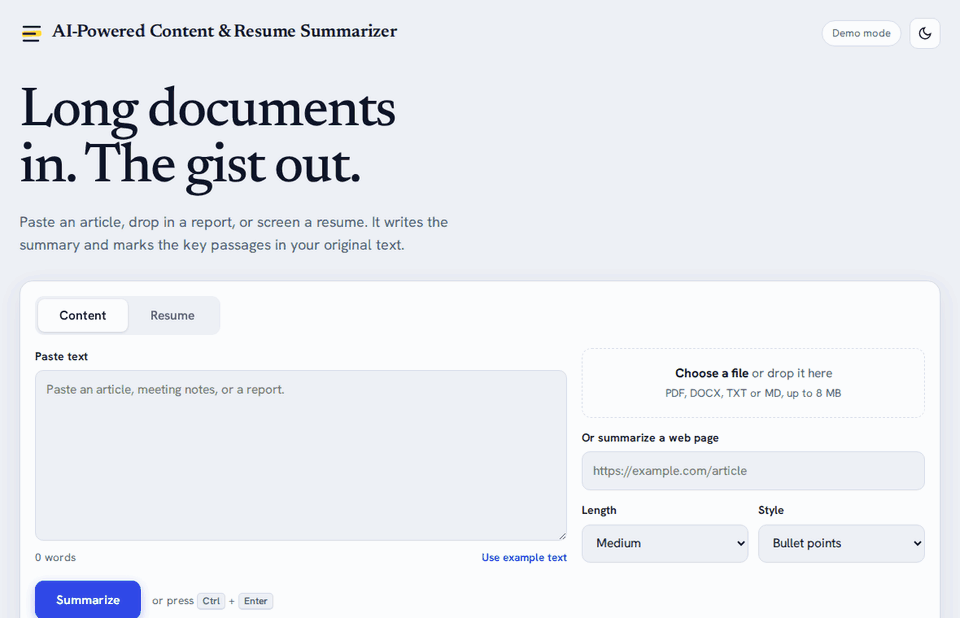
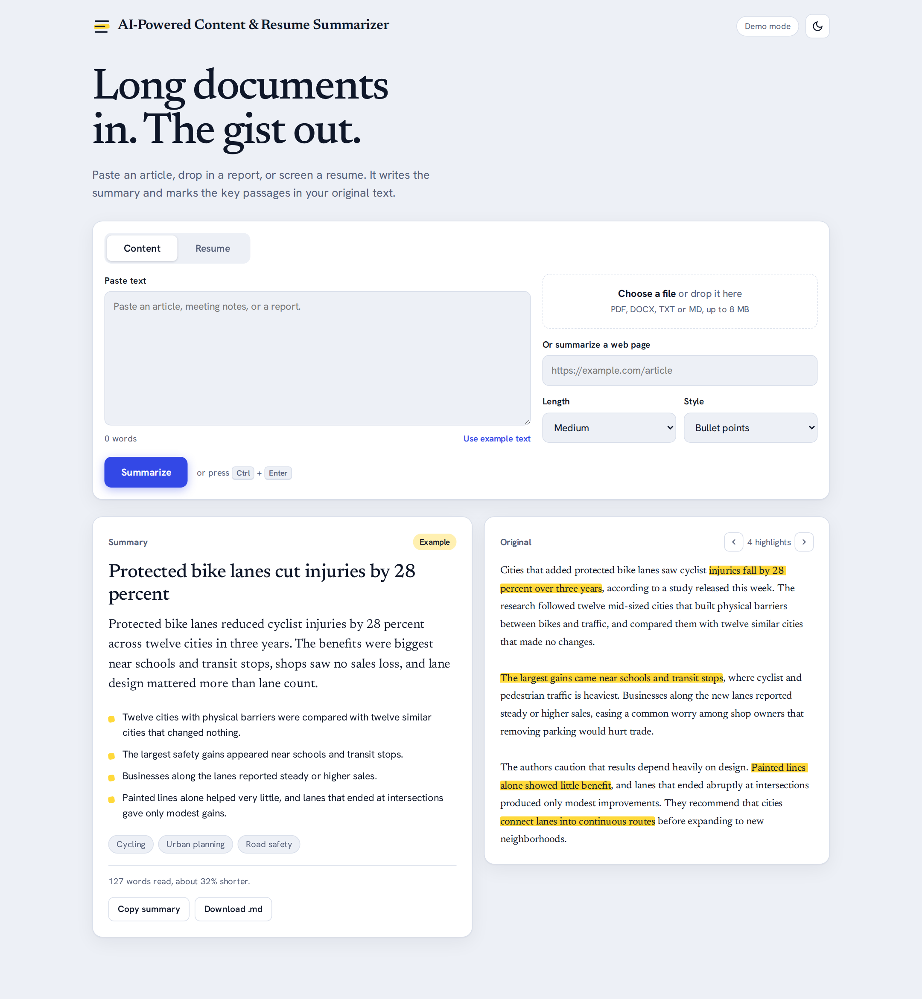
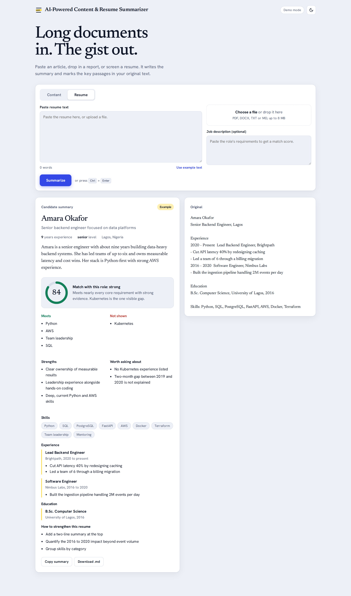
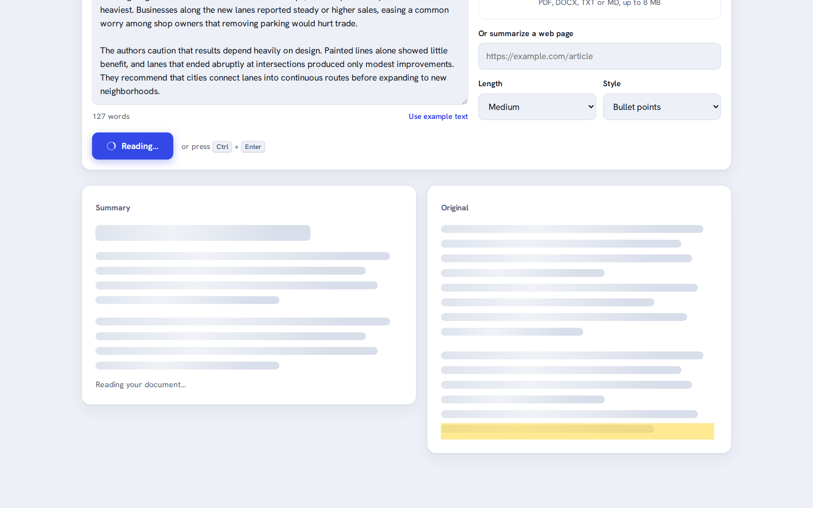
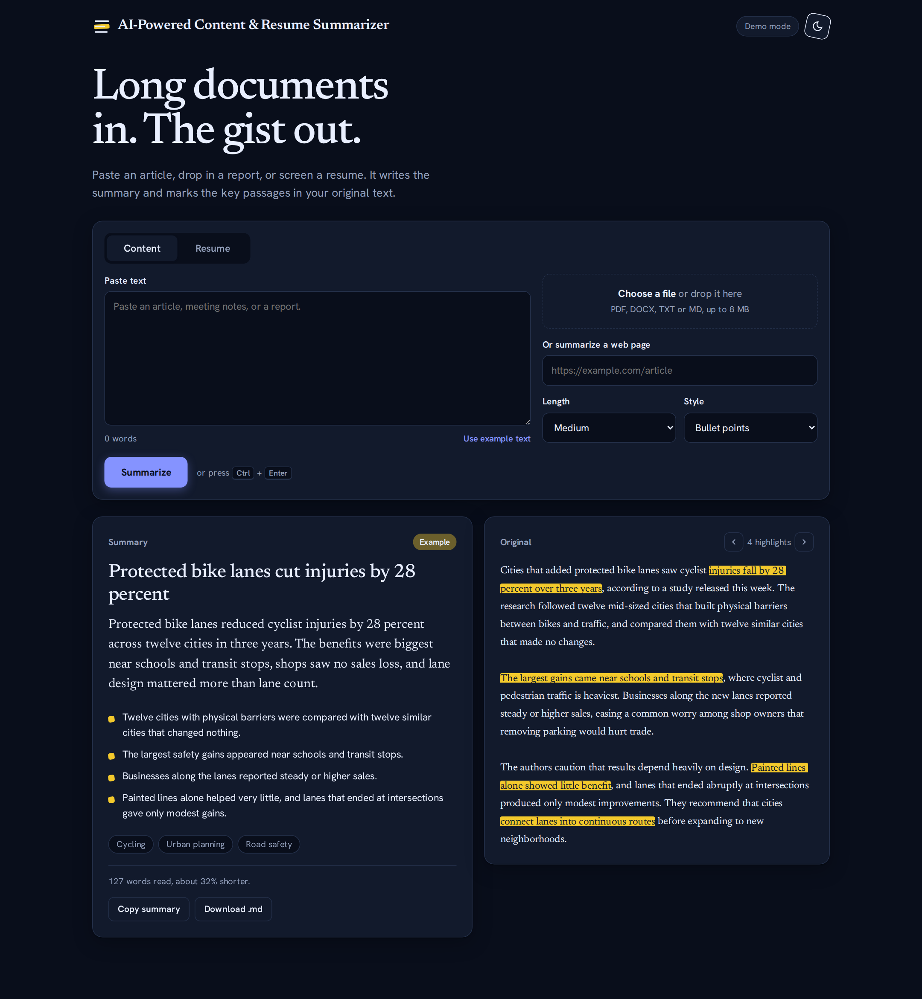
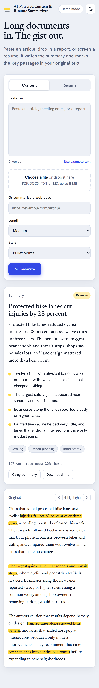

<<<<<<< HEAD
# AI-Powered Content & Resume Summarizer

Turn long documents into a clear summary in seconds. Paste an article, upload a PDF or Word file, or link a web page, and get the key points with the important passages **highlighted in the original text**. Switch to the Resume tab to get a structured candidate profile and an optional match score against a job description.

Built with **FastAPI**, the **Anthropic Claude API**, and a dependency-free HTML/CSS/JS frontend (no build step).

<p align="center">
  
</p>

## Screenshots

<p align="center">
  
</p>

| Resume analysis with job match score | Loading state |
|---|---|
|  |  |

| Dark mode | Mobile |
|---|---|
|  |  |

> Screenshots were captured in Demo mode using the built-in example text, so the summary shows the "Example" or "Basic summary" label. With an API key, summaries are written by Claude.

## Features

**Content summarizer**
- Input from pasted text, a file (PDF, DOCX, TXT, MD), or a public web link
- Choose the length (short, medium, long) and style (bullet points, executive brief, plain language)
- Key phrases are highlighted in the original text so you can verify the summary, with next/previous buttons to jump between them
- Topic tags, and a count of how much shorter the summary is
- Copy the summary or download it as Markdown

**Resume summarizer**
- Structured profile: name, headline, seniority, years of experience, skills, roles, education
- Strengths, points worth asking about, and suggestions to improve the resume
- Paste a job description to get a 0 to 100 match score with met and missing requirements

**Everywhere**
- Animated loading state, light and dark themes, responsive layout, keyboard shortcut (Ctrl/Cmd + Enter)
- Animations respect the "reduce motion" setting
- Demo mode that works with no API key (see [Modes](#modes))

## Quick start

### 1. Requirements

- **Python 3.10 or newer** (developed and tested on 3.12)
- An **Anthropic API key** for AI summaries (optional: without one the app runs in Demo mode). Create one at [console.anthropic.com](https://console.anthropic.com/).

### 2. Get the code

```bash
git clone https://github.com/<your-username>/ai-content-resume-summarizer.git
cd ai-content-resume-summarizer
```

### 3. Create a virtual environment and install dependencies

**macOS / Linux**
```bash
python3 -m venv .venv
source .venv/bin/activate
pip install -r requirements.txt
```

**Windows (PowerShell)**
```powershell
python -m venv .venv
.venv\Scripts\Activate.ps1
pip install -r requirements.txt
```
If PowerShell blocks the activate script, run `Set-ExecutionPolicy -Scope Process RemoteSigned` first, or use Command Prompt with `.venv\Scripts\activate.bat`.

### 4. Add your API key

**macOS / Linux**
```bash
cp .env.example .env
```
**Windows**
```powershell
copy .env.example .env
```

Open `.env` and paste your key after `ANTHROPIC_API_KEY=`. Leave it empty to try Demo mode.

### 5. Start the app

```bash
uvicorn backend.main:app --reload
```

Open **http://localhost:8000** in your browser. Interactive API docs are at **http://localhost:8000/docs**.

### 6. Check that your key works (recommended)

```bash
python -m backend.selfcheck
```

This sends a small sample to the real API and confirms the summary and resume analysis come back in the expected format. If the header of the app shows a "Demo mode" badge, no API key was found.

## Modes

| Mode | When | What you get |
|---|---|---|
| **AI mode** | `ANTHROPIC_API_KEY` is set | Summaries and resume analysis written by Claude |
| **Demo mode** | No key, or `DEMO_MODE=1` | A simple keyword-based fallback so you can try the interface offline. It is **not AI**: results are labelled "Basic summary" and the header shows "Demo mode" |

## Configuration

Set these in `.env` or as environment variables.

| Variable | Default | Description |
|---|---|---|
| `ANTHROPIC_API_KEY` | empty | Your Anthropic API key. Empty means Demo mode |
| `ANTHROPIC_MODEL` | `claude-sonnet-5-5` | Claude model used for summaries |
| `DEMO_MODE` | unset | Set to `1` to force Demo mode even if a key is present |
| `MAX_UPLOAD_MB` | `8` | Largest file accepted, in megabytes |
| `MAX_INPUT_CHARS` | `60000` | Longer text is cut to this length, and the UI says so |

## Run with Docker

```bash
docker build -t ai-summarizer .
docker run -p 8000:8000 --env-file .env ai-summarizer
```

Then open http://localhost:8000.

## API

The frontend uses a small JSON API you can call directly. Full interactive docs live at `/docs`.

**Summarize content**
```bash
# Pasted text
curl -X POST http://localhost:8000/api/summarize/content \
  -F "text=Paste your article text here, at least a few sentences long..." \
  -F "length=short" -F "style=bullets"

# A file
curl -X POST http://localhost:8000/api/summarize/content -F "file=@report.pdf" -F "length=medium"

# A web page
curl -X POST http://localhost:8000/api/summarize/content -F "url=https://example.com/article"
```
Fields: `text` or `url` or `file`; `length` = `short | medium | long`; `style` = `bullets | executive | simple`.
Returns `title`, `tldr`, `key_points`, `topics`, `highlights`, `source_text`, `truncated`.

**Summarize a resume**
```bash
curl -X POST http://localhost:8000/api/summarize/resume \
  -F "file=@resume.pdf" \
  -F "job_description=Senior Python engineer with AWS and team leadership experience"
```
Fields: `text` or `file`; `job_description` (optional).
Returns `name`, `headline`, `summary`, `years_experience`, `seniority`, `skills`, `experience`, `education`, `strengths`, `concerns`, `improvements`, and `job_match` (`score`, `verdict`, `matched`, `missing`, `reasoning`) when a job description is given.

**Health check**: `GET /api/health` returns `{"ok": true, "model": "...", "demo": false}`.

Errors come back as `{"detail": "a plain-language message"}` with a 4xx or 5xx status.

## Project structure

```
ai-content-resume-summarizer/
├── backend/
│   ├── main.py          # API routes, input handling, error mapping
│   ├── extract.py       # PDF / DOCX / TXT extraction, safe URL fetching
│   ├── prompts.py       # All prompts and JSON schemas (edit summary behavior here)
│   ├── summarizer.py    # Claude API calls and JSON parsing
│   ├── demo.py          # Offline fallback used when there is no API key
│   └── selfcheck.py     # Verifies your API key and output format
├── frontend/
│   └── index.html       # The entire UI: design system, animations, dark mode
├── tests/
│   ├── test_core.py     # Unit tests: parsing, extraction, SSRF guard
│   ├── test_demo.py     # Unit tests for Demo mode
│   └── e2e/             # Real-browser tests (Playwright)
├── docs/                # Screenshots and demo GIF used in this README
├── Dockerfile
├── requirements.txt
├── requirements-dev.txt
└── .env.example
```

## How it works

1. The browser sends your text, file, or link to the FastAPI backend.
2. `extract.py` turns it into clean plain text. PDF hard line-wraps are rejoined so sentences stay intact.
3. `summarizer.py` sends the text to Claude with a prompt from `prompts.py` that asks for a strict JSON answer.
4. The JSON is parsed (tolerating stray formatting) and returned. The browser renders it and highlights the quoted phrases in the original text, matching across line breaks.

## Testing

**Unit tests** (fast, no network or API key needed):
```bash
pytest
```

**Browser tests** (real Chromium, real PDF and DOCX uploads, mobile layout, dark mode):
```bash
pip install -r requirements-dev.txt
playwright install chromium
python tests/e2e/make_fixtures.py

# In one terminal:
DEMO_MODE=1 uvicorn backend.main:app --port 8765
# In another:
python tests/e2e/run_browser_checks.py
```
On Windows PowerShell, start the server with `$env:DEMO_MODE=1; uvicorn backend.main:app --port 8765`.

## Troubleshooting

| Problem | Fix |
|---|---|
| Header shows **Demo mode** and summaries look basic | No API key was found. Add `ANTHROPIC_API_KEY` to `.env` and restart the server |
| "The server's API key is missing or invalid" | Check the key in `.env` has no quotes or spaces, and that your Anthropic account has credit |
| "Too many requests" | You hit a rate limit. Wait a minute and try again |
| "No readable text found" for a PDF | The PDF is a scan (image only). Run OCR on it first, or paste the text |
| A web link fails | The page may need JavaScript to show its content, or it is blocked. Paste the text instead |
| "That address can't be fetched" | Links to localhost and private network addresses are blocked on purpose |
| `uvicorn: command not found` | Activate the virtual environment first (step 3) |
| `ModuleNotFoundError: backend` | Run `uvicorn` from the project root folder, not from inside `backend/` |
| Port 8000 already in use | Use another port: `uvicorn backend.main:app --port 8001` |

## Security and privacy

- **Nothing is stored.** Documents are processed in memory and sent to the Anthropic API only to generate the result.
- **Untrusted documents.** Prompts tell the model to treat document text as data and ignore any instructions hidden inside it.
- **Link safety.** URL fetching refuses private, loopback, and link-local addresses and re-checks every redirect.
- **Resume screening.** The prompt forbids guessing protected traits such as age or gender. Treat match scores as a first-pass aid, never as a hiring decision.
- Never commit your `.env` file. It is already listed in `.gitignore`.

## Known limits

- Scanned (image-only) PDFs need OCR before upload.
- Pages that build their content with JavaScript may not return article text.
- Highlights depend on the model quoting the source exactly. Matching ignores line-break differences but a paraphrased quote will not be highlighted.
- Very long documents are cut at `MAX_INPUT_CHARS`.
- Demo mode is a heuristic, not AI, and is meant for trying the interface.

## Roadmap

- Streaming responses
- Batch resume upload with a ranked shortlist
- OCR for scanned PDFs
- Sign-in, rate limiting, and saved history
- Export to PDF or DOCX
- Multi-language output

## Contributing

Issues and pull requests are welcome. Please run `pytest` before submitting, and describe what you changed and why.

## License

Released under the [MIT License](LICENSE).
=======
# AI-Powered-Content-Resume-Summarizer
>>>>>>> c3c20e3d073b759cebf644f34a4cc19cdd23d3a2
